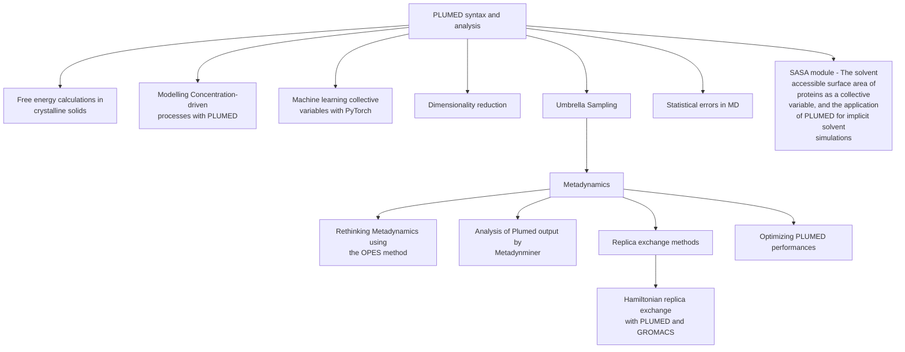
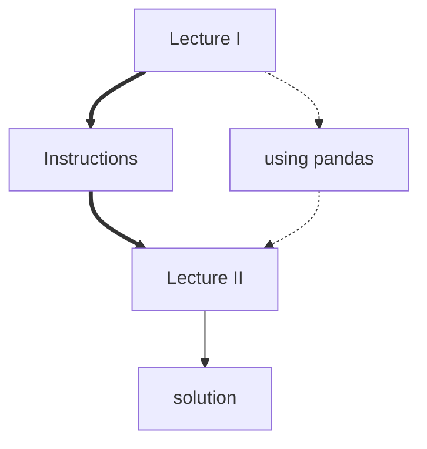

Browse the lessons
------------------------

The graph below shows a subset of the lessons that have been submitted to the PLUMED-TUTORIALS website and suggests an order for working through them. PLUMED-TUTORIAL monitors whether PLUMED input files in these lessons are compatible with the current and development versions of the code and integrates links from these files to the PLUMED manual.  Inputs in the tutorials listed below were last tested on {{ site.data.date.date }}.
   
   You can return to a complete list of the tutorials by clicking [here](browse.md).

Another graph

