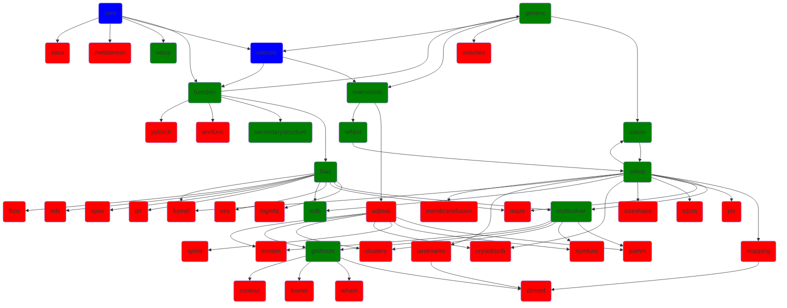

```mermaid   
flowchart TD
0("bias")
style 0 fill:green
1("generic")
style 1 fill:green
2("mapping")
style 2 fill:red
3("multicolvar")
style 3 fill:green
4("secondarystructure")
style 4 fill:green
5("colvar")
style 5 fill:green
6("annfunc")
style 6 fill:red
7("vatom")
style 7 fill:green
8("volumes")
style 8 fill:red
9("dimred")
style 9 fill:red
10("symfunc")
style 10 fill:red
11("function")
style 11 fill:green
12("ves")
style 12 fill:red
13("crystdistrib")
style 13 fill:red
14("adjmat")
style 14 fill:red
15("isdb")
style 15 fill:green
16("clusters")
style 16 fill:red
17("landmarks")
style 17 fill:red
18("valtools")
style 18 fill:blue
19("gridtools")
style 19 fill:green
20("matrixtools")
style 20 fill:green
21("refdist")
style 21 fill:green
22("contour")
style 22 fill:red
23("core")
style 23 fill:blue
24("drr")
style 24 fill:red
25("opes")
style 25 fill:red
26("eds")
style 26 fill:red
27("envsim")
style 27 fill:red
28("fisst")
style 28 fill:red
29("fourier")
style 29 fill:red
30("funnel")
style 30 fill:red
31("membranefusion")
style 31 fill:red
32("pamm")
style 32 fill:red
33("setup")
style 33 fill:green
34("logmfd")
style 34 fill:red
35("maze")
style 35 fill:red
36("metatensor")
style 36 fill:red
37("piv")
style 37 fill:red
38("pytorch")
style 38 fill:red
39("s2cm")
style 39 fill:red
40("sasa")
style 40 fill:red
41("sizeshape")
style 41 fill:red
42("sprint")
style 42 fill:red
43("wham")
style 43 fill:red
23-->11;
23-->18;
23-->33;
23-->36;
23-->40;
0-->34;
0-->3;
0-->35;
0-->12;
0-->15;
0-->24;
0-->25;
0-->26;
0-->28;
0-->30;
11-->0;
11-->1;
11-->4;
11-->6;
11-->38;
1-->7;
1-->8;
1-->20;
20-->14;
20-->21;
2-->9;
21-->5;
5-->2;
5-->3;
5-->35;
5-->37;
5-->39;
5-->41;
5-->13;
5-->15;
5-->17;
5-->30;
5-->31;
18-->20;
3-->32;
3-->10;
3-->16;
3-->19;
3-->27;
7-->5;
19-->9;
19-->43;
19-->29;
19-->22;
17-->9;
14-->32;
14-->10;
14-->42;
14-->13;
14-->16;
14-->19;
14-->27;
1-->18;
18-->11;
5-->7;
click 0 "bias.html" "Information about the module [Authors: list of authors]"
click 1 "generic.html" "Information about the module [Authors: list of authors]"
click 2 "mapping.html" "Information about the module [Authors: list of authors]"
click 3 "multicolvar.html" "Information about the module [Authors: list of authors]"
click 4 "secondarystructure.html" "Information about the module [Authors: list of authors]"
click 5 "colvar.html" "Information about the module [Authors: list of authors]"
click 6 "annfunc.html" "Information about the module [Authors: list of authors]"
click 7 "vatom.html" "Information about the module [Authors: list of authors]"
click 8 "volumes.html" "Information about the module [Authors: list of authors]"
click 9 "dimred.html" "Information about the module [Authors: list of authors]"
click 10 "symfunc.html" "Information about the module [Authors: list of authors]"
click 11 "function.html" "Information about the module [Authors: list of authors]"
click 12 "ves.html" "Information about the module [Authors: list of authors]"
click 13 "crystdistrib.html" "Information about the module [Authors: list of authors]"
click 14 "adjmat.html" "Information about the module [Authors: list of authors]"
click 15 "isdb.html" "Information about the module [Authors: list of authors]"
click 16 "clusters.html" "Information about the module [Authors: list of authors]"
click 17 "landmarks.html" "Information about the module [Authors: list of authors]"
click 18 "valtools.html" "Information about the module [Authors: list of authors]"
click 19 "gridtools.html" "Information about the module [Authors: list of authors]"
click 20 "matrixtools.html" "Information about the module [Authors: list of authors]"
click 21 "refdist.html" "Information about the module [Authors: list of authors]"
click 22 "contour.html" "Information about the module [Authors: list of authors]"
click 23 "core.html" "Information about the module [Authors: list of authors]"
click 24 "drr.html" "Information about the module [Authors: list of authors]"
click 25 "opes.html" "Information about the module [Authors: list of authors]"
click 26 "eds.html" "Information about the module [Authors: list of authors]"
click 27 "envsim.html" "Information about the module [Authors: list of authors]"
click 28 "fisst.html" "Information about the module [Authors: list of authors]"
click 29 "fourier.html" "Information about the module [Authors: list of authors]"
click 30 "funnel.html" "Information about the module [Authors: list of authors]"
click 31 "membranefusion.html" "Information about the module [Authors: list of authors]"
click 32 "pamm.html" "Information about the module [Authors: list of authors]"
click 33 "setup.html" "Information about the module [Authors: list of authors]"
click 34 "logmfd.html" "Information about the module [Authors: list of authors]"
click 35 "maze.html" "Information about the module [Authors: list of authors]"
click 36 "metatensor.html" "Information about the module [Authors: list of authors]"
click 37 "piv.html" "Information about the module [Authors: list of authors]"
click 38 "pytorch.html" "Information about the module [Authors: list of authors]"
click 39 "s2cm.html" "Information about the module [Authors: list of authors]"
click 40 "sasa.html" "Information about the module [Authors: list of authors]"
click 41 "sizeshape.html" "Information about the module [Authors: list of authors]"
click 42 "sprint.html" "Information about the module [Authors: list of authors]"
click 43 "wham.html" "Information about the module [Authors: list of authors]"
```
